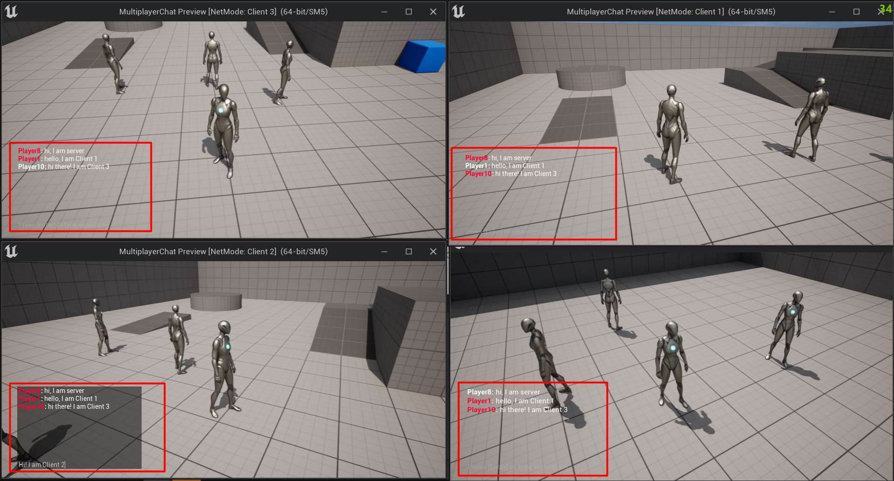

# Unreal C++ | In Game Multiplayer Chat

## Features
- %100 coded in C++
- %100 replicated.
- Designed with UMG.
- Easy to understand & use
- Messages sent by you are shown in a different color, while those of others are shown in a very different color.
- After you win the match, you can annoy your opponent by typing "gg EZ".

## Controls
- Press 'Enter' in game anytime.
- Write your message and press 'Enter' again.
- Continue to playing your game.

### Example Screenshot

